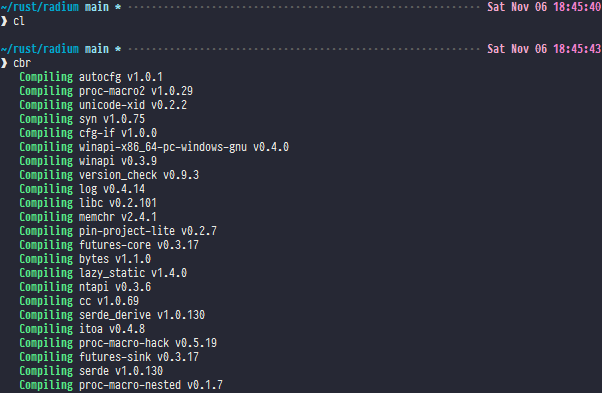

# bashrc

My personal `.bashrc` file. Makes the terminal look comfortable, and provides a
number of Bash aliases mainly focused around Rust and its associated tools.

## Terminal

In the above screenshot, the two commands are `cargo clean` and
`cargo build --release`, respectively. (the first one isn't `cc` as you might
expect because I have that aliased to `cargo clippy`)

## Aliases
Aliases are designed to be as short as possible without conflicting with each
other or with standard tools & commands.

This can lead to them being a little hard to remember if not used frequently.
As such, an `aliases` alias is also provided to list them all, though really
it just wraps the existing Bash `alias` default command.

Many of the aliases are more than just simple redirects - a lot of them apply
switches and CLI arguments to achieve certain expected behaviour.

Some notable alias types:
- General Bash commands
	- Making `ls` provide certain information and display a certain way by
	default
	- Shortening `exit` and `clear` to single characters
- Git commands for common operations
	- Automatically sign all commits
- An absolute ton of [Cargo](https://doc.rust-lang.org/cargo/) commands
and Rust tools
    - Many of which have variants for Debug/Release mode
    - `no-std` checking alias that runs [`cargo nono`](https://github.com/hobofan/cargo-nono)
	then builds for a target that doesn't support `std`
    - Meant to be used alongside [my Rust project template](https://github.com/zedseven/rust-template-general)

## Used Tools
- Git
- Rust (`nightly`)
- [Clippy](https://github.com/rust-lang/rust-clippy)
- [Miri](https://github.com/rust-lang/miri)
- [cargo-generate](https://github.com/cargo-generate/cargo-generate)
- [cargo-expand](https://github.com/dtolnay/cargo-expand)
- [cargo-nono](https://github.com/hobofan/cargo-nono)
- [cargo-license](https://github.com/onur/cargo-license)
- [cargo-outdated](https://github.com/kbknapp/cargo-outdated)

## Environment
Currently (as of 2021-11-06) used with [Git For Windows](https://gitforwindows.org/),
though it should work without modification on an actual Linux Bash
installation.
